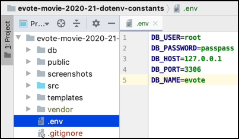

# evote-movie-2020-21-dotenv-constants

Modern PHP applications now store credentials, such as DB constants, in a ".env" file in the project root folder.



- delete the `/config` folder that contained the `dbConstants.php` script

- since we'll be loading these environment variables in the `WebApplication` constructor, we can remove the `require_once` statement for DB constants from our `/public/index.php` script:
    
    ```php
    <?php
    session_start();
    
    require_once __DIR__ . '/../vendor/autoload.php';
    
    use Tudublin\WebApplication;
    
    $app = new WebApplication();
    $app->run();
    ```

- add the Symfony dotenv library to our project:

    ```bash
    composer require symfony/dotenv
    ```

    - it should add files to the `/vendor` folder and `compsoer.json'
    
    ```bash
    composer require symfony/dotenv
    
  Using version ^5.0 for symfony/dotenv
    ./composer.json has been updated
    Loading composer repositories with package information
    Updating dependencies (including require-dev)
    Package operations: 1 install, 0 updates, 0 removals
      - Installing symfony/dotenv (v5.0.7): Loading from cache
    Writing lock file
    Generating autoload files
    1 package you are using is looking for funding.
    Use the `composer fund` command to find out more!

    ```

- create a `.env` file containing your DB credentials:

    ```dotenv
    DB_USER=root
    DB_PASS=passpass
    DB_HOST=127.0.0.1
    DB_PORT=3306
    DB_NAME=evote
    ```
  
- at present, the `pdo-crud-for-free-repositories` library doesn't automatically load from a **dotenv** (".env") file, in the next release if it detects such a file it will load the DB constants from there. For now we have to load the values from `.env` and set the constants. We can do this in a new class `/src/DotEnvLoader.php` with a single method `loadDBConstantsFromDotenv()`:
    
    ```php
    <?php
    namespace Tudublin;
    
    use Symfony\Component\Dotenv\Dotenv;
    
    class DotEnvLoader
    {
        public function loadDBConstantsFromDotenv()
        {
            // load dotenv file
            $dotenv = new Dotenv();
            $dotenv->load(__DIR__.'/../.env');
    
            // extract values
            $user = $_ENV['DB_USER'];
            $password = $_ENV['DB_PASS'];
            $host = $_ENV['DB_HOST'];
            $port = $_ENV['DB_PORT'];
            $database = $_ENV['DB_NAME'];
    
            // declare global constants for pdo-crud-for-free-repositories
            define('DB_USER', $user);
            define('DB_PASS', $password);
            define('DB_HOST', $host . ":" . $port);
            define('DB_NAME', $database);
        }
    }
    ```

- finally, we need to create a `DotEnvLoader` object and invoke this new method from the `WebApplication` constructor method:

    ```php
    public function __construct()
    {
        $this->mainController = new MainController();
        $this->movieController = new MovieController();
        $this->loginController = new LoginController();
        $this->adminContoller = new AdminController();

        $dotEnvLoader = new DotEnvLoader();
        $dotEnvLoader->loadDBConstantsFromDotenv();    
    }
    ```
  
- also we'll be doing the same for our fixtures files `/db/migrateAndLoadUserFixtures.php` & '/db/migrationAndFixtures.php':

    ```php
    <?php
    require_once __DIR__ . '/../vendor/autoload.php';
    
    use Tudublin\DotEnvLoader;
    // ... other USER statements here for whichever Repository is being used ...
    
    // load DB constants from DOTENV
    $dotEnvLoader = new DotEnvLoader();
    $dotEnvLoader->loadDBConstantsFromDotenv();
    ```

